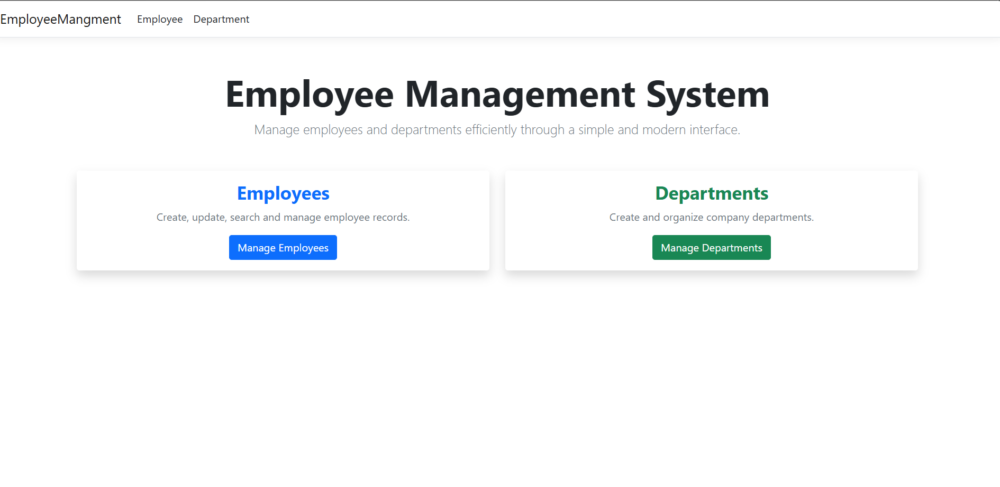
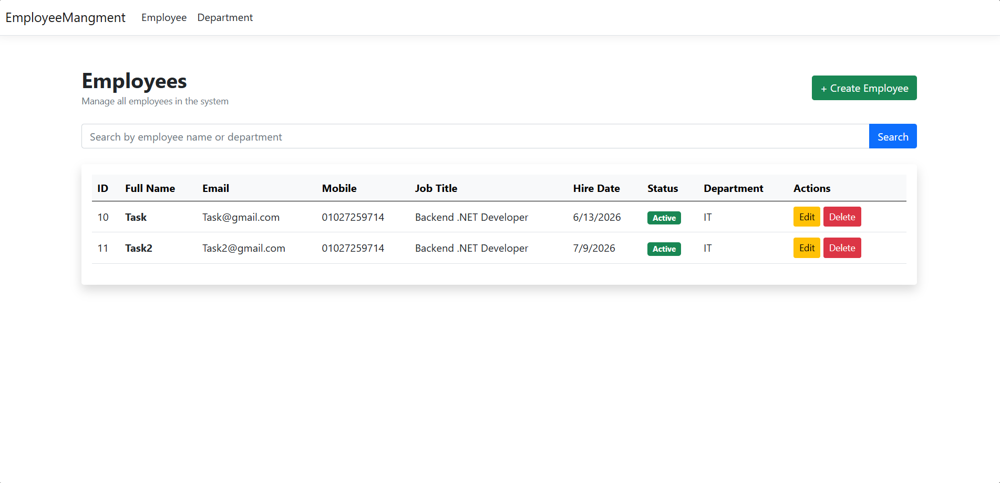
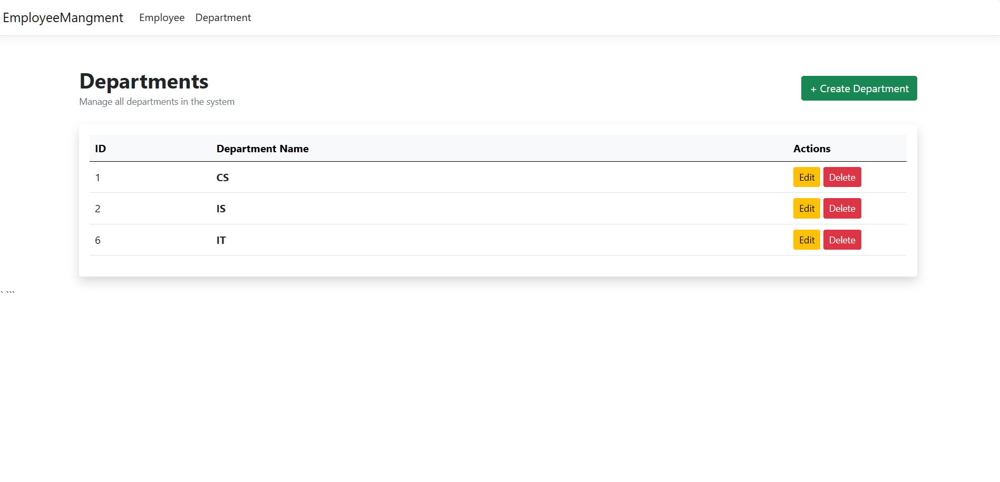
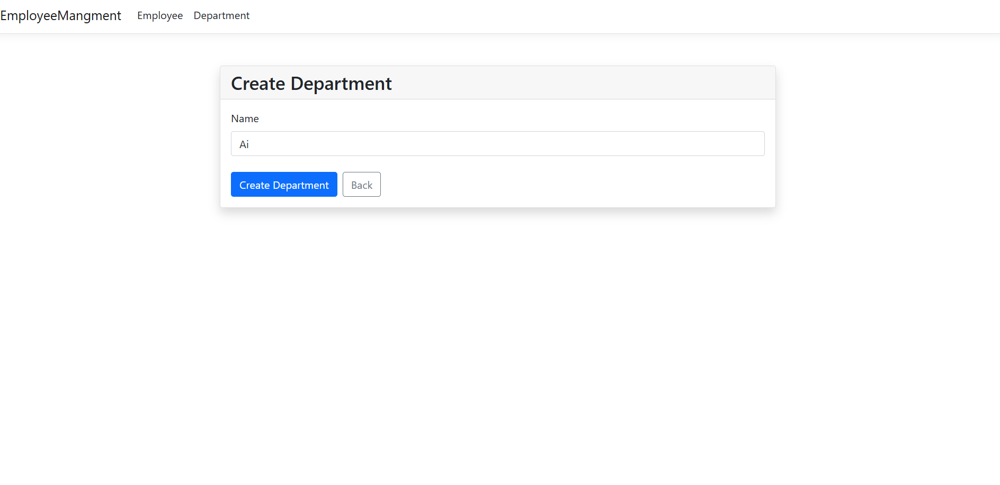
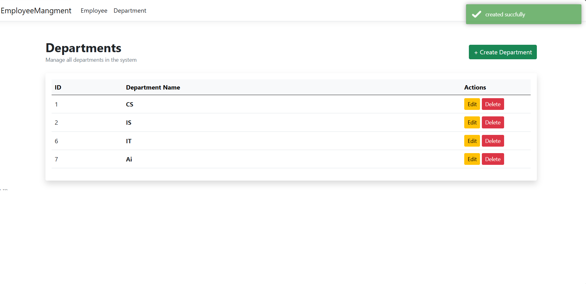
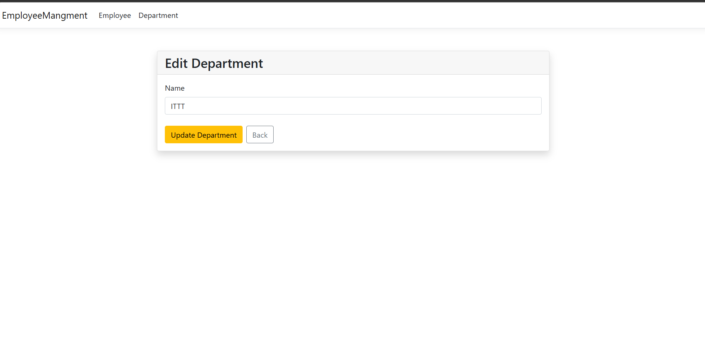
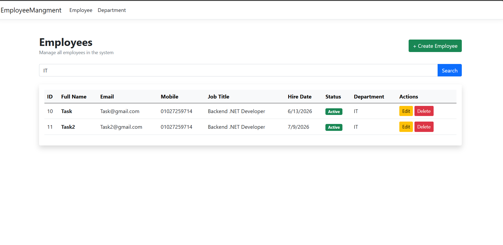
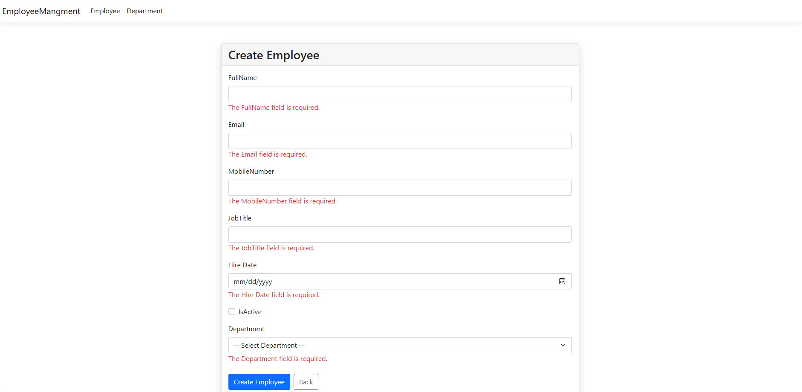
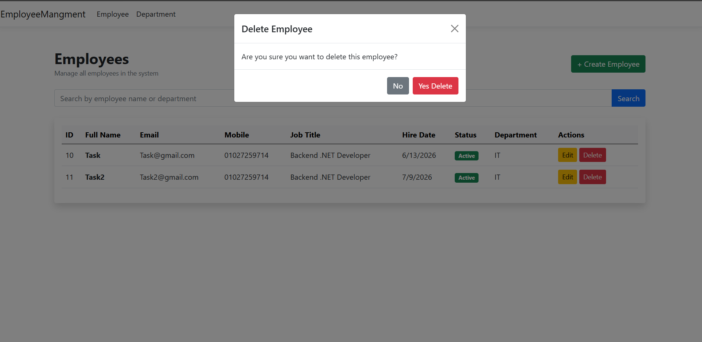

# Employee Management System

## Overview

Employee Management System is a web application built using ASP.NET Core MVC and Entity Framework Core.

The application allows users to manage employees and departments through a simple and user-friendly interface.

---

## Features

### Employee Management

- Create Employee
- Update Employee
- Delete Employee
- View Employees
- Search Employees by Name or Department
- Employee Validation

### Department Management

- Create Department
- Update Department
- Delete Department
- View Departments

### Additional Features

- Repository Pattern
- Entity Framework Core
- SQL Server Database
- Bootstrap 5 UI
- Toastr Notifications
- Responsive Design

---

## Technologies Used

- ASP.NET Core MVC
- Entity Framework Core
- SQL Server
- Bootstrap 5
- Toastr.js
---

## Database

The project uses SQL Server with Entity Framework Core Code First approach.

Migration files are included in the repository.

---

## How To Run

### 1. Clone Repository

```bash
git clone https://github.com/youssief-ibrahim/EmployeeMangment.git
```

### 2. Open Project

Open the solution file in Visual Studio.

### 3. Configure Connection String

Update the connection string inside:

```json
appsettings.json
```

Example:

```json
"ConnectionStrings": {
  "defultconnection": "Server=.;Database=EmployeeMangment;Trusted_Connection=True;TrustServerCertificate=True"
}
```

### 4. Apply Database Migration

Open Package Manager Console and run:

```powershell
Update-Database
```

### 5. Run Application

Press:

```text
F5
```

## Screenshots

### Home Page
Main dashboard of the Employee Management System.



---

### Employees List
View all employees with their details and available actions.



---

### Department List
Manage departments and view existing departments.



---

### Create Department
Create a new department.



---

### Department Created Successfully
Confirmation after successfully creating a department.



---

### Update Department
Edit existing department information.



---

### Search Functionality
Search employees by name or department.



---

### Employee Validation
Validation message when submitting invalid employee data.



---

### Delete Confirmation
Confirmation dialog before deleting a record.



---

### Success Operation Message
Success notification after completing an operation.


